[hiphop-2010s-with-kado on Spotify](https://open.spotify.com/playlist/0hoveiSeLmq25MhJ8Ne1V9?si=Yfa0ht_MQhKqsHGlVG52JA)

---
---

# #20 Chief Keef

**Genre** Experimental Hip Hop, Trap, Cloud Rap

**Top songs**
- I Don't Like
- Love Sosa
- Faneto

---
---

# #19 Yung Lean

**Genre** Cloud Rap, Trap, Alternative R&B

**Top songs**
- Kyoto
- Ginseng Strip 2002
- Yoshi City
- Blue Plastic
- Hoover
- Red Bottom Sky
- Hurt
- Hennessy & Sailor Moon

---
---

# #18 Tyler The Creator

**Genre** Pop Rap, Jazz Rap, Cloud Rap

**Top songs**
- Rella ft Hodgy, Domo genesis
- Boredom
- Who Dat Boy / 911
- Yonkers
- OKRA
- Potato Salad
- I Ain't Got Time!
- She

---
---

# #17 Mac Miller
[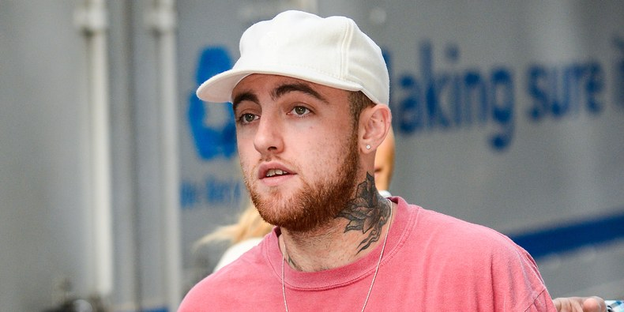](https://www.youtube.com/watch?v=Mos8UiWV6_g)

**Genre** Cloud Rap, Abstract Hip Hop, West Coast Hip Hop

**Top songs**
- Self care
- Dang!
- Star room
- Programs
- Small World
- S.D.S
- 100 Grandkids
- Watching Movies

---
---

# #16 Pusha T
[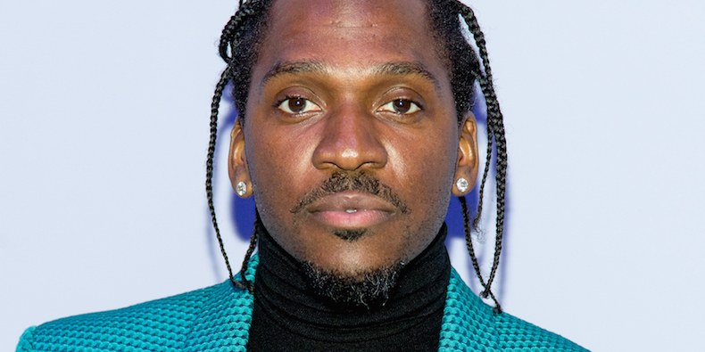](https://www.youtube.com/watch?v=L7-0ugujS2U)

**Genre** Southern Hip Hop, Hardcore Hip Hop, Gangsta Rap, Trap,

**Top songs**
- Trouble On My Mind feat. Tyler, The Creator
- The Story of Adidon
- Numbers on the Boards
- Nosetalgia
- If You Know You Know

---
---

# #15 Earl Sweatshirt
[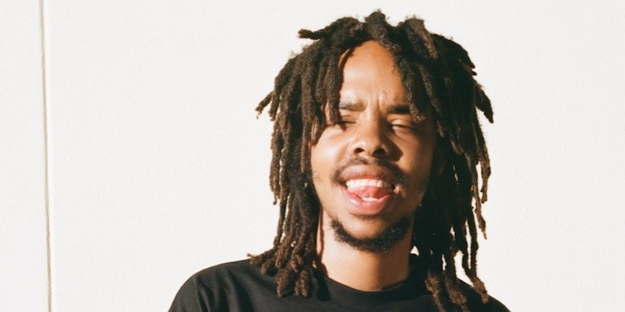](https://www.youtube.com/watch?v=tZ5Mu2gs-M8)

**Genre** West Coast Hip Hop, Abstract Hip Hop, Cloud Rap

**Top songs**
- Hive
- Grief
- Chum
- WHOA
- Quest/Power
- Nowhere2go
- The Mint
- Off Top

---
---

# #14 Travis Scott

**Genre** Trap, Southern Hip Hop, Pop Rap, Experimental Hip Hop, Electropop, Hardcore Hip Hop

**Top songs**
- Sicko Mode
- Pick Up the Phone
- Antidote
- Watch
- Goosebumps
- Highest in the Room
- Butterfly Effect
- Mamacita
- Piss on Your Grave

---
---

# #13 Run The Jewels
[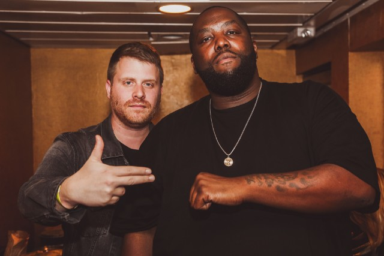](https://www.youtube.com/watch?v=vWaljXUiCaE)

**Genre** Hardcore Hip Hop, Experimental Hip Hop, Novelty

**Members** El-P (producer, vocals), Killer Mike (vocals)

**Top songs**
- Oh My Darling Don't Cry
- Close Your Eyes
- Blockbuster Night Pt. 1
- Legend Has It
- Banana Clipper
- Run the Jewels

---
---

# #13 Drake
[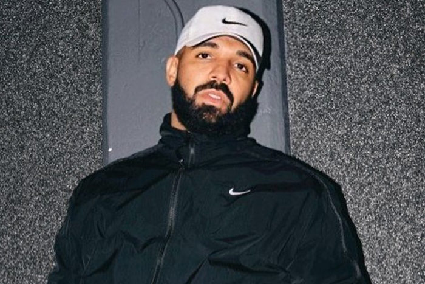](https://www.youtube.com/watch?v=CAzsA2OCZFs)

**Genre** Pop Rap, Contemporary R&B, Trap

**Top songs**
- jumpman
- Hold On, We're Going Home
- Passionfruit
- Marvins Room
- Hotline Bling
- Back To Back
- Energy

---
---

# #12 Kendick Lamar

**Genre** West Coast Hip Hop, Conscious Hip Hop, Jazz Rap

**Top songs**
- Alright
- The Blacker the Berry
- Swimming Pools (Drank)
- A.D.H.D
- Monster
- HiiiPoWeR
- HUMBLE.
- King Kunta
- Cartoon + Cereal

---
---

# #11 Death Grips

**Genre** Abstract Hip Hop, Hardcore Hip Hop, Glitch Hop

**Top songs**
- Get Got
- I've Seen Footage
- Black Paint
- More Than the Fairy
- Guillotine
- Inanimate Sensation
- The Powers That B

---
---

# #10 Vince Staples
[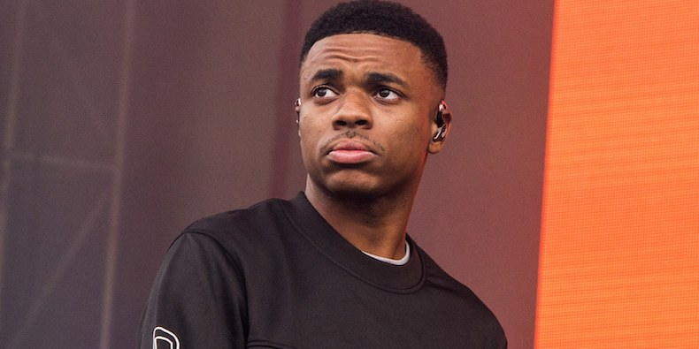](https://www.youtube.com/watch?v=NJLfCBBcZAo)

**Genre** West Coast Hip Hop, Hardcore Hip Hop, Experimental Hip Hop

**Top songs**
- Norf Norf
- blue suede
- big fish
- Get the Fuck Off My Dick
- BagBak

---
---

# #9 Lil Uzi Vert
[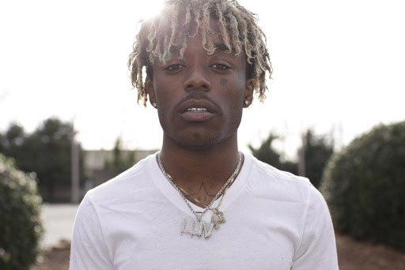](https://www.youtube.com/watch?v=bnFa4Mq5PAM)

**Genre** Trap, Pop Rap, Emo Rap

**Top songs**
- 20 min
- XO Tour Llif3
- The Way Life Goes
- Sanguine Paradise
- Ps & Qs

---
---

# #8 Future

**Genre** Trap, Southern Hip Hop, Pop Rap

**Top songs**
- Mask Off
- March Madness
- 56 nights
- Monster
- Incredible
- Codeine Crazy

---
---

# #7 Brockhampton
[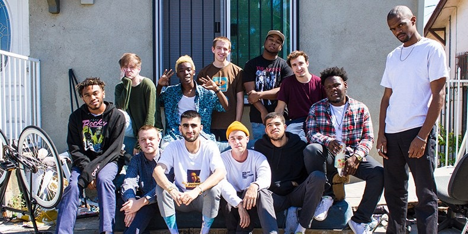](https://www.youtube.com/watch?v=1nDsnJH30fs)

**Genre** - Pop Rap, West Coast Hip Hop, Hardcore Hip Hop

**Members** Kevin Abstract (vocals, director), Dom McLennon (vocals, production), Merlyn Wood (vocals), Matt Champion (vocals), Joba (vocals, production, engineering), bearface (vocals, production)

**Top songs**
- JUNKY
- GUMMY
- SWEET
- BOOGIE
- Heat
- 1999 Wildfire
- 1998 Truman
- No Halo
- Star

---
---

# #6 Denzel Curry
[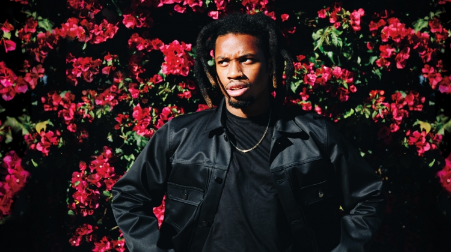](https://www.youtube.com/watch?v=s0hMu9FUjmk)

**Genre** - Hardcore Hip Hop, Experimental Hip Hop, Boom Bap

**Top songs** 
- ULT
- BLACK BALLOONS | 13LACK 13ALLOONZ
- Ultimate
- Zeltron 6 Billion
- Bulls on Parade (triple j Like a Version)
- Ricky
- CLOUT COBAIN | CLOUT CO13A1N
- Gook
- PERCS | PERCZ

---
---

# #5 Young Thug
[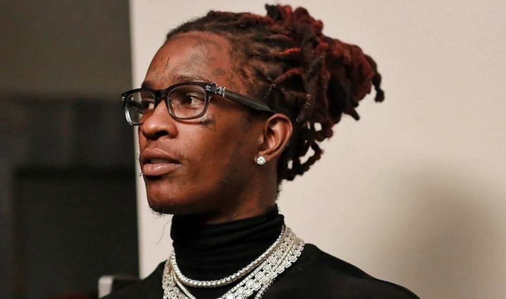](https://www.youtube.com/watch?v=KyCTZ8c-trc)

**Genre** Southern Hip Hop, Trap, Pop Rap

**Top songs** 
- Old English
- Halftime
- With them
- Family dont matter
- Hercules
- Digits
- Danny Glover
- Thief in the Night
- Check
- Webbie
- Memo
- Liger
- Surf
- Hot

---
---

# #4 Danny Brown
[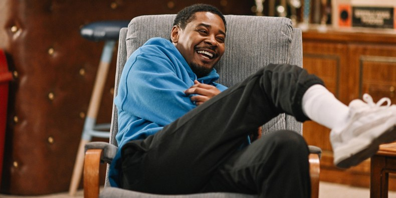](https://www.youtube.com/watch?v=7L4JnAuW00k&t=153s)

**Genre** - Hardcore Hip Hop, Experimental Hip Hop, Boom Bap

**Top songs**
- Aint it funny
- when it rain
- monopoly
- Really doe
- Grown Up
- Best life

---
---

# #3 JPEGMAFIA

**Genre** - Pop Rap, Hip Hop, Experimental Hip Hop

**Top songs**
- 1539 N. Calvert
- Puff Daddy
- Beta Male Strategies
- Baby I’m bleeding
- free the frail
- PTSD
- All my heros are cornballs

---
---

# #2 Kanye West 
[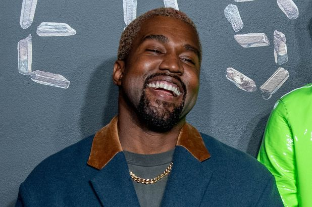](https://www.youtube.com/watch?v=KEA0btSNkpw)

**Genre** - Pop Rap, Hip Hop, Experimental Hip Hop

**Top songs**
- Devil in a New Dress
- No More Parties in L.A.
- Saint Pablo
- New Slaves
- Black Skinhead
- Blood on the Leaves
- Lift Yourself
- Runaway
- Ultralight Beam
- Bound 2

---
---

# #1 Playboi Carti 
[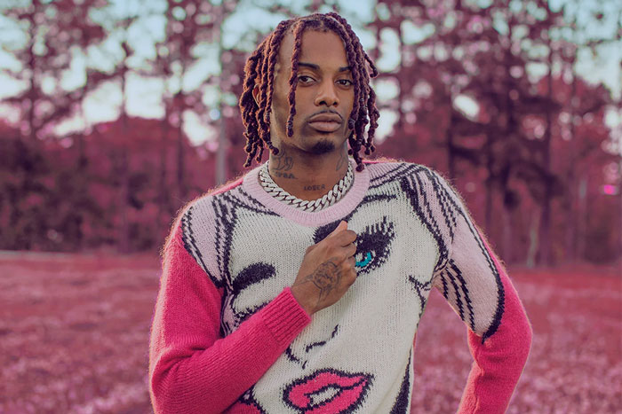](https://www.youtube.com/watch?v=4wuKo7-Nt6w)

**Genre** - Trap, Cloud Rap, Southern Hip Hop

**Top songs** 
- Broke Boi
- Fetti
- Talk
- YUNGXANHOE
- love hurts
- wokeuplikethis*
- WHAT
- FlatBed Freestyle
- Lookin
- no time
- Let It Go
- RIP

---
---

